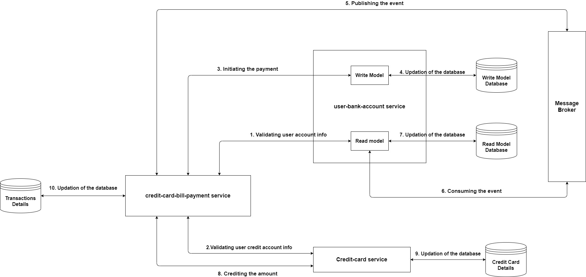

# Going-The-Microservice-Way

Microservices are an architectural approach to building applications. As an architectural framework, microservices are distributed and loosely coupled, so one team’s changes won’t break the entire app. The benefit to using microservices is that development teams are able to rapidly build new components of apps to meet changing business needs.

This project consists of mainly three microservices:
 1. credit-card-bill-payment service.
 2. user-bank-account service.
 3. credit-card service

The above diagram shows the exact flow of the credit card bill payment process and the functionalities of these services.
This architecture follows both saga as well as CQRS design pattern. For saga the credit-card-bill-payment service acts as an orchestrator whereas, the user-bank-account service 
uses the CQRS design pattern.
The message broker in this project is Apache Kafka which projects the updation of write model datastore to read model datastore.

